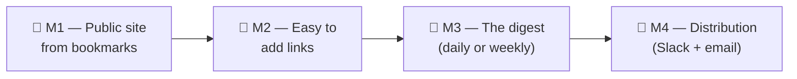

# feat: RWL build sequence — site-first re-order

> **This plan supersedes the _sequencing_ of [docs/plans/2026-05-24-001-feat-rwl-greenfield-build-plan.md](2026-05-24-001-feat-rwl-greenfield-build-plan.md).** The product is unchanged. The original was ordered foundations-first (DB → capture → AI → digest → Slack → website last); this re-orders the same work around **visible-value milestones**, with the public website first. The original plan's detailed unit specs (U1–U14) remain the reference for unit internals; this plan re-orders them, records honest build status, and re-details the not-yet-built site units. **U-IDs are preserved** (no renumbering) so traceability holds across both documents.

---

## Why this plan exists

The first plan optimized for "no rework" (build each layer before the one that depends on it). For a solo creator who needs to **see and use** the product, the better optimization is "fastest path to something real and visible." John's reordering — **bookmarks → live site → easy adding → digest → distribution** — does that. This document encodes it.

**What RWL is:** John Intrater's curated AI-links publication (Read · Watch · Listen). Save a link → AI drafts a one-line "why" → a daily/weekly digest John approves → it publishes to a Slack channel, an email list, and a public website. Attribution everywhere: "Curated by John Intrater · Assembled by Claude." (Full requirements in the origin doc.)

---

## Honest status (2026-05-25)

| State | Meaning | Units |
|---|---|---|
| ✅ **Shipped & verified** | Runs in the real world today | U1 (repo + Neon Postgres + CI), U2 (capture API — **live** at `rwl-api.vercel.app`, proven against real Shiori), U3 (Chrome extension — proven; iOS uses Shiori's own Shortcut) |
| 🟡 **Written, never run live** | Code exists, unit tests pass, but it has **never executed end-to-end** against real services | U4 (LLM "why" + R/W/L + consume-time), U5 (daily digest composer), U6 (Slack approval DM + auto-ship timer), U13 (bookmark bootstrap importer) |
| ❌ **Not built** | No code yet | U7 (multi-surface fan-out), U8 (Weekend Reads), **U9–U12 (the public website)**, U14 (ops/runbook) |

**Two caveats that matter:**
- **Nothing in the 🟡 set is verified.** No real digest has been composed; no Slack DM sent. It *should* work; it has not been *shown* to work.
- **Local secrets are blanked.** A `vercel env pull` on 2026-05-24 wiped `DATABASE_URL` and `LLM_API_KEY` from `apps/api/.env.local` (Vercel returns Sensitive vars empty). Production is unaffected, but local runs/tests against the DB or LLM need these restored first (Vercel Storage → rwl for the DB string; Anthropic for the key).

---

## Build sequence — 4 milestones

| Milestone | Outcome | Units | Status of those units |
|---|---|---|---|
| **M1 — Public site from bookmarks** | Your Twitter bookmarks live on a real URL | U13 (run), U9, U10, U11, U12 | importer written; **site not built** |
| **M2 — Easy to add links** | Save a link → it appears on the site | U2, U3 (done), U4, deploy-hook | capture done; enrichment + hook to wire |
| **M3 — The digest** | A recap is produced (daily or weekly) | U5, U8 | composer written; Weekend Reads not built |
| **M4 — Distribution** | The digest goes out to Slack + email | U6, U7 | Slack written; **fan-out not built** |

The hard dependency that forces M1 first in practice: **the website (U9–U12) is the single biggest unbuilt piece, and it's the only one that produces something John can look at.** Everything else either already works (capture) or is automation that's only valuable once there's a site and a corpus.

---

## Milestone 1 — Public site from your bookmarks ← **NEXT**

**Outcome:** John's existing Twitter/X bookmarks, imported and rendered on a real, deployed public URL. This is a complete win on its own — even if we built nothing else.

**Shape:** the bookmark importer (U13, written) lands items in the Postgres spine + Shiori; a new Astro static site reads that spine at build time, joins Shiori bookmark facts, renders a card grid, and deploys to Vercel. Per the store model (origin + 2026-05-24 plan): **Postgres owns editorial fields** (note, R/W/L, consume-time, slug), **Shiori owns bookmark facts** (title, thumbnail, archived page), joined on `shiori_id` at build time.

**Prerequisites (from John, operational — not code):**
1. A Twitter/X bookmarks export as JSON ([twitter-web-exporter](https://github.com/prinsss/twitter-web-exporter)) dropped at `apps/bootstrap/input/bookmarks.json`.
2. `DATABASE_URL`, `SHIORI_TOKEN`, `LLM_API_KEY` restored to `apps/api/.env.local`.

**Open decision (M1):** bookmark scope for v1 — **all of them lightly** (everything up, prune later) vs **AI-filtered + approve each** (the U13 flow as written). Resolve when we run the import.

---

### U13 (run) — Import bookmarks into the spine *(existing code; operational gate)*

**Goal:** Execute the already-written `@rwl/bootstrap` importer against John's real export so the corpus exists in Postgres (`bootstrap=true`) + Shiori before the site build.

**Status:** Code shipped (commit `0d7fbbd`); **never run.** This unit is "run it for real + fix whatever reality breaks," not new construction.

**Dependencies:** U2 (capture core it calls), U13 code, the M1 prerequisites above.

**Files:** none new expected; bug-fixes to `apps/bootstrap/src/*` if the real export shape differs from the defensive parser's assumptions.

**Approach:** restore secrets → `pnpm --filter @rwl/bootstrap start` → review/approve → verify rows land in `captures` (with `bootstrap=true`, `captured_at` = original tweet date) and bookmarks appear in Shiori. Confirm the parser handles John's actual export (the parser is defensive across three known shapes; a real sample may reveal a fourth).

**Test scenarios:** `Test expectation: none` — operational verification of existing, unit-tested code. Functional proof is the rows in Postgres + Shiori.

**Verification:** `SELECT count(*) FROM captures WHERE bootstrap = true` matches the approved count; spot-checked bookmarks exist in Shiori with correct dates.

---

### U9 — Astro site scaffold + Postgres/Shiori content loader

**Goal:** Stand up the Astro 5 static site with a build-time content loader that reads the RWL spine from Postgres and joins Shiori bookmark facts, plus the base layout and a Card component.

**Requirements:** R13, R23, R27. **Dependencies:** U13 (run) — there must be items to render.

**Files:**
- Create: `apps/site/package.json`, `apps/site/astro.config.mjs`, `apps/site/tsconfig.json`
- Create: `apps/site/src/content/config.ts` (content loader)
- Create: `apps/site/src/lib/db.ts` (build-time `pg` read) and `apps/site/src/lib/items.ts` (spine query + Shiori join)
- Create: `apps/site/src/lib/filters.ts` (R/W/L media + time-bucket thresholds as exported consts — shared with U10 and U4)
- Create: `apps/site/src/layouts/Base.astro`, `apps/site/src/components/Card.astro`
- Test: `apps/site/test/items.test.ts`

**Approach:**
- At build time, query Postgres for the spine: `captures` rows that are `shiori_status='synced'` (so each has joinable facts + a live permalink), selecting `url, note, rwl_tag, consume_minutes, shiori_id, captured_at, title`. Join Shiori facts via `listLinks` (the client method added in U5) keyed on `shiori_id`; fall back to the cached `title` when a Shiori record is missing rather than dropping the item.
- `lib/filters.ts` defines the medium set (Read/Watch/Listen) and time buckets (Quick <5 / Medium 5–20 / Deep 20+ min). Reuse the thresholds already in `apps/api/src/types.ts` (`TIME_BUCKETS`/`timeBucketFor`) — copy or re-export to avoid drift.
- Base layout = wordmark + nav (Discover / Browse / About). Card = source/brand, linked title, the "why" note, R/W/L icon, consume-time badge.
- Astro **static output** on Vercel (`@astrojs/vercel`), no SSR — the site is rebuilt on publish.

**Patterns to follow:** Astro Content Layer docs; `apps/api/src/lib/db.ts` for the `pg` pool pattern; `apps/api/src/lib/shiori.ts` `listLinks`. Visual reference: curated.supply.

**Test scenarios:**
- Happy path: loader returns N items for N synced, non-dropped captures; each carries `{ url, title, note?, rwlTag, consumeMinutes?, slug, capturedAt }`.
- Edge: a capture whose Shiori record is missing at build → falls back to cached title, still included.
- Edge: an item missing a required field (e.g. no title and no URL) → logged + dropped, build does not fail.
- Error: Postgres unreachable at build → build fails fast with a clear error (don't ship an empty site).

**Verification:** `pnpm --filter @rwl/site build` produces a non-empty `dist/` with a card per imported bookmark.

---

### U10 — Homepage card grid + medium/time filters

**Goal:** The homepage: wordmark, nav, one-liner, a newest-first card grid of all items, and two filter rows (medium + time-to-consume) that narrow the grid client-side.

**Requirements:** R13, R14, R27, AE6. **Dependencies:** U9.

**Files:**
- Create: `apps/site/src/pages/index.astro`
- Create: `apps/site/src/components/Filters.tsx` (Preact island — medium + time)
- Modify: `apps/site/astro.config.mjs` (add `@astrojs/preact`)
- Test: `apps/site/test/filters.test.ts`

**Approach:** render a card per item, newest-first, over the whole collection. Two single-select filter rows (medium, time) each with an implicit "All"; selecting hides/shows cards via DOM class toggling and reflects state in `?medium=`/`?time=` params; the two compose (e.g. Watch + Quick). **The email subscribe form is deferred to M4** (no email pipeline until then) — leave space for it or stub it.

**Patterns to follow:** curated.supply hero composition; Astro islands for minimal hydration; `lib/filters.ts` from U9 (no hardcoded duplicate thresholds).

**Test scenarios:**
- **Covers AE6 (adapted).** Happy path: grid renders; selecting Watch filters to watch items; adding Quick narrows further; URL updates to `?medium=watch&time=quick`.
- Edge: zero items match → "Nothing matches — clear a filter." empty state.
- Edge: select then clear a filter → grid returns to all for that axis.
- Integration: filter controls match `lib/filters.ts` buckets exactly.

**Verification:** visit the built homepage, filter by each axis, see the grid narrow and the URL update.

---

### U11 — Archive + Pagefind search + RSS *(fast-follow — site can ship without it)*

**Goal:** Browseable archive (`/archive/[medium]`, `/archive/[year]/[week]`), client-side full-text search via Pagefind, and an RSS feed.

**Requirements:** R14, R23, R25. **Dependencies:** U9, U10.

**Files:**
- Create: `apps/site/src/pages/archive/[medium].astro`, `apps/site/src/pages/archive/[...week].astro`
- Create: `apps/site/src/pages/rss.xml.ts`, `apps/site/src/components/SearchBox.tsx`
- Modify: `apps/site/astro.config.mjs` (`astro-pagefind`)
- Test: `apps/site/test/archive.test.ts`

**Approach:** Astro `getStaticPaths` for per-medium and per-ISO-week pages; Pagefind as a post-build step indexing `dist/`; `@astrojs/rss` feed of items (and, later, digests) with stable `<guid>`s. Weekend Reads / digest permalink pages are added with M3/M4, not here.

**Test scenarios:**
- Happy path: `/archive/watch` lists all watch items; `/archive/2026/W22` lists that ISO week.
- Happy path: search returns results for a term in a "why" note.
- Edge: empty archive → friendly empty state, not a 404.
- Edge: RSS validates as well-formed XML.

**Verification:** visit the archive routes, run a search, fetch `/rss.xml`.

---

### U12 — Deploy the site to Vercel + domain *(was "Cloudflare Pages" — corrected)*

**Goal:** `apps/site` builds and deploys to **Vercel** (static output); the site is reachable on `rwl.johnintrater.com` with valid TLS; a deploy hook exists so a publish can trigger a rebuild (consumed in M2/M4).

**Requirements:** R23, R13. **Dependencies:** U11 (or U10 for a minimal first deploy).

**Files:**
- Modify: `apps/site/astro.config.mjs` (`@astrojs/vercel` static adapter)
- Create: a `apps/site` Vercel project config / link
- Possibly: `.github/workflows/` or Vercel git integration

**Approach:** create a second Vercel project for `apps/site` (build at repo root scoped to `apps/site`, output static). The build needs `DATABASE_URL` + `SHIORI_TOKEN` as build env (the loader reads them). Configure `rwl.johnintrater.com` DNS. Create a Vercel **deploy hook** URL and store it as `VERCEL_DEPLOY_HOOK_URL` (M2/M4 fire it). Verify TLS, caching, 404 page. **Deploy note (carried from U3):** deploy via remote build, not `--prebuilt`, for pnpm-workspace dep resolution.

**Test scenarios:** `Test expectation: none` — infrastructure config; covered by U9–U11 build tests + a live smoke check.

**Verification:** the site is live on `rwl.johnintrater.com` showing the imported bookmarks; a `POST` to the deploy hook triggers a rebuild within ~60s.

---

## Milestone 2 — Easy to add new links *(mostly built)*

**Outcome:** John saves a link (Chrome extension or iOS) → it shows up on the site.

**Status & what's left:**
- ✅ **Capture works today** — U2 (`POST /api/capture`, live) + U3 (Chrome extension proven; iOS via Shiori's Shortcut). New links already land in Postgres + Shiori.
- 🟡 **U4 (LLM enrichment)** is written but unrun: it drafts the "why" note + assigns R/W/L + consume-time after capture. Running it for real is what makes a freshly-saved link render well on the site. **Verify it live** during this milestone (it fires after capture via `waitUntil`).
- ❌ **Deploy-hook wiring (new):** after a capture (and its enrichment) lands, fire `VERCEL_DEPLOY_HOOK_URL` so the site rebuilds and shows the new item. Small unit; depends on U12's hook existing.

**Decision point:** rebuild-on-every-capture (simple, but a build per link) vs a debounced/periodic rebuild. Resolve when wiring the hook.

*(Detailed U4 spec: see the 2026-05-24 plan + commit `a6cdd77`. The deploy-hook unit will be detailed when M2 starts.)*

---

## Milestone 3 — The digest *(composer written)*

**Outcome:** a recap of recent items is produced for John to review.

**Status & what's left:**
- 🟡 **U5 (daily digest composer)** is written (commit `8d143f9`): Shiori→Postgres sync, pulls new items, composes in John's voice, persists a draft. **Never run live.** Verify it against the real DB + LLM here.
- ❌ **U8 (Weekend Reads)** — the weekly thematic recap — is not built.
- 📝 **Voice:** `docs/voice/` currently holds **placeholder** voice card + samples. Real samples from John materially improve quality (highest-value content input). Swap them in before relying on digest output.

**Open decision (M3):** **daily vs weekly** cadence for the first real digest. The composer is built for daily; weekly = run U8's Weekend Reads instead/as-well. John picks when we get here. (The original plan does both: daily Mon–Fri + Saturday Weekend Reads.)

*(Detailed specs: 2026-05-24 plan U5/U8 + commit `8d143f9`.)*

---

## Milestone 4 — Distribution (Slack + email) *(Slack written; send-out not built)*

**Outcome:** an approved digest goes out to the Faire Slack channel and the public email list, and the site rebuilds.

**Status & what's left:**
- 🟡 **U6 (Slack approval DM)** is written (commit `13a3d7a`): Ship/Edit/Skip DM + 30-min auto-ship timer. **Never run live** — needs the Slack app + tokens.
- ❌ **U7 (multi-surface fan-out)** is **not built**: post to the `#rwl` Slack channel, send a Buttondown broadcast, fire the site deploy hook — each with its own retry-able status row. This is the actual "publish" step. It wires into U6's existing `fanOut` injection hook.
- ❌ Email (Buttondown) integration is part of U7.

**Needs from John:** `SLACK_BOT_TOKEN`, `SLACK_SIGNING_SECRET`, `JOHN_SLACK_USER_ID`, a Faire-vs-personal-workspace decision (+ Faire bot-install policy check); `BUTTONDOWN_TOKEN`; `VERCEL_DEPLOY_HOOK_URL` (from U12).

*(Detailed specs: 2026-05-24 plan U6/U7 + commit `13a3d7a`.)*

---

## Scope boundaries

Carried from the origin + 2026-05-24 plan (unchanged by re-sequencing):

**Deferred for later:** multi-curator support; "suggest a link to John" inbox; comments on the site; per-item analytics; automated Slack-engagement read-back; social cross-posting; native mobile app beyond the Shortcut; paid tiers; AI recommendation surfaces; Notion mirror.

**Outside this product's identity:** a general Faire link-sharing tool; a discussion forum; a research database with rich taxonomy; a recommendation engine; a Faire-owned publication; a general personal blog.

**Deferred to follow-up:** custom voice-eval harness; native iOS Share Extension; self-service item retraction UI.

**Re-sequencing-specific non-goals (v1):** on the first site, the email subscribe form (M4), Weekend Reads layout (M3/M4), and digest permalink pages (M3/M4) are out — M1 is the bookmark grid + filters + search + RSS only.

---

## Key technical decisions (locked — carried forward)

- **Platform: Vercel** (Functions + Cron + Postgres; KV folded into a `kv_state` table). The site is a **second Vercel project** (`apps/site`, Astro static). *(Corrects the original U12's "Cloudflare Pages.")*
- **Store model: split ownership, merge at build.** Postgres owns editorial fields; Shiori owns bookmark facts; the site (U9) and digest (U5) read Postgres as the spine and join Shiori on `shiori_id`, excluding `shiori_status != 'synced'`.
- **Navigation: medium + time-to-consume, no topic taxonomy.** Both axes auto-derived (medium from URL/og:type, time from word count / media duration).
- **LLM = Anthropic/Claude**; attribution string `Curated by John Intrater · Assembled by Claude` (asserted across surfaces); domain `rwl.johnintrater.com`; subscribers = Buttondown-only (no DB table); Weekend Reads threaded on Slack.
- **Capture writes to Postgres + Shiori; enrichment + digest read Postgres.** Bootstrap items carry `bootstrap=true` (on the site, off the first digest) and a synthetic `captured_at`.

---

## Secrets & accounts needed (by milestone)

| Secret / account | For | Status |
|---|---|---|
| `DATABASE_URL`, `SHIORI_TOKEN` | M1 import + site build | exist in Vercel; **blanked locally — restore** |
| `LLM_API_KEY` (Anthropic) | M1 import notes, M2 enrichment, M3 digest | exists in Vercel; **blanked locally — restore** |
| Twitter/X bookmarks export | M1 corpus | **John to provide** |
| `rwl.johnintrater.com` DNS | M1 deploy | John controls the domain |
| `VERCEL_DEPLOY_HOOK_URL` | M2/M4 rebuild | created in M1 (U12) |
| `SLACK_BOT_TOKEN`, `SLACK_SIGNING_SECRET`, `JOHN_SLACK_USER_ID` | M4 Slack | **John to provide** (+ workspace decision) |
| `BUTTONDOWN_TOKEN` | M4 email | **John to provide** |

---

## Risks & mitigations (re-sequencing-relevant)

| Risk | Mitigation |
|---|---|
| The 🟡 written code has latent bugs that only surface on first real run | M1's import (U13-run) and M2's enrichment verification are the first live exercises — treat them as bug-finding, not formalities |
| The real Twitter export shape differs from the parser's assumptions | The parser is defensive across 3 shapes; share a real sample early; fix forward |
| Site build couples to Postgres availability | Build fails fast on DB-unreachable (U9) rather than shipping an empty site; the deployed site stays up on the prior build until a new one succeeds |
| Building the site before the digest means the site shows bootstrap items with default `read` tag until enrichment runs | Acceptable for v1; M2 enrichment + a re-sync pass refine tags; deterministic pattern classification already tags known video/audio hosts correctly |
| Local secrets stay blanked → can't verify anything | Restore them as the first action of M1; documented in the status section |

---

## What's explicitly NOT changing

- The product, requirements, actors, flows, and acceptance examples from the origin doc.
- The already-shipped units (U1–U3) and the already-written code (U4, U5, U6, U13) — none is discarded; it's re-ordered.
- The detailed unit specs in the 2026-05-24 plan — still the reference for unit internals.
