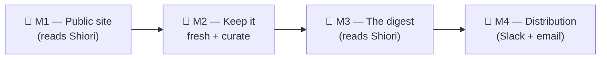

# feat: RWL — Shiori-backed lean rebuild

> **This plan supersedes the _architecture_ of both prior plans.** The product is unchanged (John's curated AI-links publication: Read · Watch · Listen). What changes is the realization that **Shiori is already the backend** — we were rebuilding capture, storage, dedupe, archiving, tagging, and a Twitter importer that Shiori (the $10/mo Pro plan John pays for) ships out of the box. This plan throws out that redundant work and builds **only what Shiori cannot do: the public face and the publication rhythm.**

---

## The decision that reframes everything

We verified shiori.sh's actual capabilities (API docs + MCP docs, 2026-05-25). Shiori is not just a bookmark store — it is a full capture-and-library backend:

- **Capture:** native **X/Twitter bookmark auto-sync** (Pro), its own browser extension, REST API, CLI, and a hosted MCP server (19 tools, OAuth).
- **Storage & enrichment:** archived page content, metadata, **AI summaries**, **AI auto-tagging**, full-text + semantic search, RSS feed ingestion, Notion sync.
- **Read API:** `GET /api/links` supports `tag`, `search`, `read`, `sort`, `since`, `offset`, `limit` (≤1000), `include_content`, and returns a `total` count.

**What Shiori does NOT do:** publish anything publicly. There is no public-share/collection endpoint and no public face. **That gap is exactly what RWL is.**

So the architecture collapses to:

```
Shiori (backend)                          RWL (what we build)
─────────────────                         ───────────────────
X sync / extension / API  ──capture──►    nothing
storage / archive / tags  ──store──►      nothing
AI summary / search       ──enrich──►     nothing
GET /api/links?tag=rwl    ──read───►      ① the public website
                                          ② the publication rhythm (digest → Slack/email)
```

**The curation gate is one Shiori tag: `rwl`.** Anything tagged `rwl` in Shiori is "in the publication." Tagging the keepers in your backlog, and tagging new saves, is the entire editorial act. The public site is just `GET /api/links?tag=rwl`.

---

## What we keep, shelve, and discard

| Built yesterday | Verdict | Why |
|---|---|---|
| `apps/api/src/lib/shiori.ts` (API client) | **Keep + extend** | Add `tag`/`search`/`sort`/`include_content`/`total` to `listLinks`. Load-bearing for the site. |
| `apps/api/src/lib/metadata.ts` (og:type, word count, duration) | **Keep** | Reused to derive medium + time-to-consume at build time. |
| `TIME_BUCKETS` / `timeBucketFor` in `types.ts` | **Keep** | Shared time-bucket thresholds for the site filters. |
| Digest composer (`digest.ts`, `digest-llm.ts`), `voice.ts`, `prompts/*` | **Keep, defer to M3** | Genuinely RWL — Shiori doesn't compose digests in your voice. Will read from Shiori instead of Postgres. |
| Slack approval (`slack.ts`, `approval.ts`) | **Keep, defer to M4** | RWL-specific distribution. |
| `apps/bootstrap` (U13 importer) | **Discard / superseded** | Shiori's native X sync does exactly this. Mark deprecated. |
| `apps/chrome-extension` (U3) | **Discard / superseded** | Shiori ships its own browser extension. |
| Capture endpoint + dedupe (`api/capture.ts`, `capture.ts`, `url.ts`) | **Shelve** | Shiori captures and dedupes on save. Not needed unless a future feature requires our own capture path. |
| Enrichment (`enrich.ts`, `classify.ts`) | **Shelve** | Medium is URL-derived at build; Shiori does AI tagging. Revisit only if we want server-side R/W/L beyond URL heuristics. |
| Postgres schema + migrations (`0001_initial.sql`) | **Shelve** | No backend needed until the publication rhythm needs to persist a digest draft (M3). Nothing deleted — just not on the M1 path. |

**Nothing good is thrown away.** The site is greenfield either way (it never existed), and the digest/voice/Slack/API-client work is reused. The discarded pieces (importer, extension) duplicated Shiori.

---

## Milestones



| Milestone | Outcome | Backend needed? |
|---|---|---|
| **M1 — Public site** | Your `rwl`-tagged Shiori links live on `rwl.johnintrater.com` | **None** — static site reads Shiori at build |
| **M2 — Fresh + curate** | New `rwl` tags appear on the site automatically; curating = tagging in Shiori | None (scheduled rebuild) |
| **M3 — The digest** | A recap of recent `rwl` items, composed in your voice for review | Minimal (persist a digest draft) |
| **M4 — Distribution** | Approved digest goes to Slack + email | Reuse shelved Slack/email code |

---

## Milestone 1 — Public site from Shiori ← **IN PROGRESS**

**Outcome:** a real, deployed public URL showing your curated AI links, read straight from Shiori. **Zero backend** — no Postgres, no capture API, no enrichment pipeline.

### Status — 2026-05-25 (end of day)

**Done & verified locally:**
- ✅ **Corpus.** X sync enabled in Shiori; full backlog backfilled = **501 bookmarks** (Apr 2021 → May 2026), 500/501 enriched. Created the `rwl` tag, auto-tagged the AI items, pruned false positives → **205 curated items** = the launch corpus. (Backfill spent the 500 monthly credits; the site needs none going forward.)
- ✅ **U-S1 + U-S2 built** — `apps/site` (Astro 5, static) reads the 205 `rwl` items from Shiori at build time and renders an editorial card grid modeled on curated.supply: Fraunces masthead, medium + time filter pills, newest-first. Builds locally with all 205 cards; dev server (hot-reload) used for design iteration with John.
- ✅ **Reality adaptations** baked in: a **browser User-Agent** on the loader (Shiori's API is behind Cloudflare that 403s default UAs — error 1010); real bookmark dates recovered from **tweet IDs** + Shiori's `publication_date`; an **og:image puller** for items that link to articles (disk-cached; ~26 of ~50 resolved → ~70 of 205 now have real images); imageless cards fall back to a **typographic plate** showing the tweet/article text; headlines prefer a resolved article's real **title** over the AI summary.

**Remaining for M1:**
- ⬜ **U-S4 — Deploy to Vercel + domain.** The site is **not live yet (local only).** Add `@astrojs/vercel`, a second Vercel project, `SHIORI_TOKEN` build env, `rwl.johnintrater.com` DNS/TLS, and a deploy hook. *Build note:* it currently runs via the Astro bin directly to dodge a pnpm-11 verify-deps-before-run failure (unbuilt `sharp`); sort the build command for CI/Vercel.
- ⬜ **U-S3 — RSS feed** (not built).
- ⬜ **Design polish** (ongoing): broken-thumbnail fallback (dead twimg images → plate); whether short *tweet* cards should show their own text vs the AI summary; type/spacing refinement.
- ⬜ **Tests** — `apps/site/test/*` not yet written.
- 🟨 **Open product finding:** the corpus is ~96% tweets, so the **Read/Watch/Listen + time filters barely differentiate** (196 Read / nearly all Quick). Decide whether to keep them, navigate by another axis (topic / source / date), or resolve linked-article media to enrich the medium. Carry into M2.

**Operational prerequisites (you, not code):**
1. **Enable X sync** in your Shiori account so your Twitter bookmarks populate your library.
2. **Tag the keepers `rwl`** in Shiori (curate-first — the site shows only tagged items). *Open knob: if you'd rather launch with everything and prune later, the site query drops the `tag` filter — a one-line change.*
3. Restore `SHIORI_TOKEN` to the build environment (it's blanked locally).

### U-S1 — `apps/site` scaffold + Shiori content loader
- **Create:** `apps/site/{package.json, astro.config.mjs, tsconfig.json}`; `src/lib/shiori.ts` (or import the existing client); `src/lib/items.ts` (build-time fetch of `GET /api/links?tag=rwl&sort=newest&limit=1000&include_content=true`, paginated via `total`/`offset`); `src/lib/derive.ts` (medium from URL/host + og:type; time bucket from word count / duration, reusing `metadata.ts` + `TIME_BUCKETS`).
- **Approach:** Astro 5 **static** output (`@astrojs/vercel`). Loader maps each Shiori link → `{ url, title, summary, medium, timeBucket, tags, createdAt }`. Medium: youtube/vimeo → `watch`; spotify/apple-podcasts/overcast/soundcloud → `listen`; else `read`. Time: word-count ÷ ~220 wpm for reads, declared duration for watch/listen, omit badge when unknown.
- **Test:** `apps/site/test/items.test.ts` (mapping, medium derivation, pagination, missing-field tolerance).
- **Verify:** `pnpm --filter @rwl/site build` produces a non-empty `dist/` with a card per `rwl` link. Build **fails fast** if Shiori is unreachable (don't ship an empty site).

### U-S2 — Homepage card grid + medium/time filters
- **Create:** `src/layouts/Base.astro` (wordmark + nav), `src/components/Card.astro` (source, linked title, medium icon, time badge), `src/pages/index.astro`, `src/components/Filters.tsx` (Preact island — medium + time, client-side, reflected in `?medium=&time=`).
- **Note:** no per-item "why" notes (deferred per decision); no email form (M4). Card shows Shiori title + source; optionally Shiori's AI `summary` as supporting text.
- **Verify:** filter by each axis, grid narrows, URL updates.

### U-S3 — RSS feed *(fast-follow)*
- **Create:** `src/pages/rss.xml.ts` (`@astrojs/rss` over `rwl` items, stable guids).

### U-S4 — Deploy to Vercel + domain
- Second Vercel project scoped to `apps/site`, static output, `SHIORI_TOKEN` as build env, `rwl.johnintrater.com` DNS + TLS. Create a **deploy hook** (`VERCEL_DEPLOY_HOOK_URL`) for M2. Deploy via remote build (not `--prebuilt`) for pnpm-workspace resolution.
- **Verify:** site is live showing your `rwl` links; `POST` to the deploy hook rebuilds within ~60s.

**Client-side search (Pagefind)** is deferred to M2: Shiori's search is authenticated and can't be called from a public browser, so a static site needs its own index. Not M1-blocking.

---

## Milestone 2 — Keep it fresh + curate *(light)*

**Outcome:** new `rwl`-tagged links show up on the site without manual work; curating stays inside Shiori.

- **Freshness:** Shiori has no outbound webhook (pull-only API), so the site refreshes via a **scheduled rebuild** — a Vercel Cron (or external scheduler) that fires `VERCEL_DEPLOY_HOOK_URL` on an interval (e.g. hourly), plus manual trigger. *Decision: rebuild cadence.*
- **Curate:** the act of saving to Shiori (extension / X / share) + tagging `rwl` is the publish action. No RWL capture path needed.
- **Pagefind search** lands here.
- **Revisit notes here if wanted:** if you decide the "why" note should appear on the site, this is where we choose a store — Shiori's editable `summary` field (no RWL backend) vs a small RWL key-value store. Deferred by decision for M1.

---

## Milestone 3 — The digest *(reuse composer, source from Shiori)*

**Outcome:** a recap of recent `rwl` items, composed in John's voice, for review.

- Reuse `digest.ts`/`digest-llm.ts`/`voice.ts`/`prompts/*` but **source items from Shiori** (`GET /api/links?tag=rwl&since=<last>`), not the shelved Postgres spine.
- Minimal persistence reintroduced **only here** (a digest draft + its status) — likely the smallest slice of the shelved schema (`digests`, maybe `kv_state`), not the whole thing.
- **Swap in real voice samples** — `docs/voice/` currently holds placeholders; real samples are the highest-value content input.
- **Open decision:** daily vs weekly (Weekend Reads) cadence for the first real digest.

---

## Milestone 4 — Distribution *(reuse Slack/email)*

**Outcome:** an approved digest goes to the Faire Slack channel + the public email list, and the site rebuilds.

- Reuse `slack.ts`/`approval.ts` (Ship/Edit/Skip DM). Add Buttondown broadcast + fire `VERCEL_DEPLOY_HOOK_URL`.
- **Needs from John:** `SLACK_BOT_TOKEN`, `SLACK_SIGNING_SECRET`, `JOHN_SLACK_USER_ID` (+ workspace decision); `BUTTONDOWN_TOKEN`.
- Reassess scope: the durable auto-ship timer and per-surface retry rows built in U6 may be more than v1 needs — keep only what a solo weekly cadence actually requires.

---

## Locked decisions (this rebuild)

- **Shiori is the backend.** RWL builds no capture, storage, dedupe, archiving, or import. (Discards `apps/bootstrap` + `apps/chrome-extension`.)
- **Curation gate = the `rwl` Shiori tag.** Site = `GET /api/links?tag=rwl`. Backlog default: **curate-first** (flippable to show-all).
- **M1 has zero backend.** Static Astro site on Vercel reading Shiori at build time.
- **"Why" notes deferred** for the first site (revisit in M2/M3).
- **Medium** derived from URL/og:type; **time-to-consume** from word count / declared duration.
- **Platform: Vercel** (site = static project). Domain `rwl.johnintrater.com`. Email = Buttondown. Attribution: "Curated by John Intrater · Assembled by Claude."

---

## Secrets & accounts (by milestone)

| Secret / account | For | Status |
|---|---|---|
| `SHIORI_TOKEN` | M1 site build (the only secret M1 needs) | exists in Vercel; **restore locally** |
| X sync enabled in Shiori | M1 corpus | **John to enable in Shiori** |
| `rwl.johnintrater.com` DNS | M1 deploy | John controls domain |
| `VERCEL_DEPLOY_HOOK_URL` | M2 rebuild | created in M1 (U-S4) |
| `LLM_API_KEY` (Anthropic) | M3 digest voice | exists in Vercel; restore when M3 starts |
| `SLACK_*`, `BUTTONDOWN_TOKEN` | M4 distribution | John to provide at M4 |

---

## Risks & mitigations

| Risk | Mitigation |
|---|---|
| Backlog floods the public site with noise | Curate-first via the `rwl` tag; site shows only tagged items |
| Site couples to Shiori availability at build | Build fails fast on unreachable Shiori; deployed site stays on the last good build |
| Shiori rate limits (60/min) during build | Paginate with `limit=1000`; one build is a handful of calls — well under the cap |
| Re-deriving medium/time at build is imperfect | URL heuristics handle known hosts; unknown time → omit the badge rather than guess |
| Reusing shelved code (digest/Slack) drifts from Shiori-as-source | Re-point those to `GET /api/links` at M3/M4; treat first live runs as bug-finding |

---

## What's explicitly NOT changing

- The product, requirements, actors, and acceptance examples from the origin doc.
- The reusable code (Shiori client, metadata, time buckets, digest/voice/Slack) — re-pointed, not rewritten.
- The milestone *spirit* of the site-first re-sequence (visible value first) — this plan keeps it and removes the backend we don't need.
